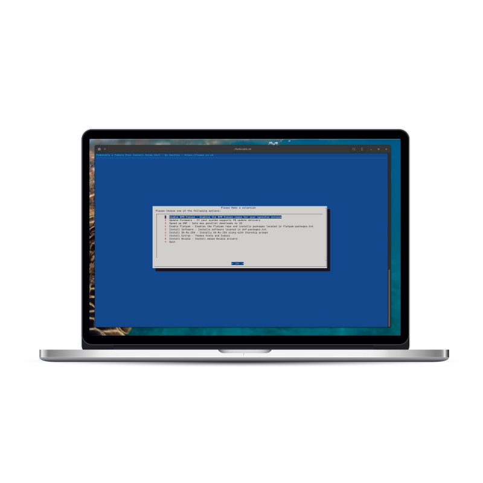

<h1 align="center">
  Fedorable - a post install helper script for the GNOME desktop environment.

</h1>
<p align="center">
  
</p>

# Introduction
The Fedorable script is a powerful post-install setup utility for Fedora-based systems running the GNOME desktop environment. It automates several system configuration tasks, from enabling repositories and installing software to customizing your GNOME settings, ensuring your system is optimized and ready to use.
This guide will help you understand the various features of the script and how to use them effectively.

# Screenshot


# Contents of the Script
The Fedorable script contains the following key functionalities:

1. **Enable RPM Fusion**: Adds the RPM Fusion repositories to your system, which provide additional software packages that are not available in the default Fedora repositories.
2. **Update Firmware**: Utilizes fwupdmgr to check for and install any available firmware updates.
3. **Speed Up DNF**: Optimizes DNF, Fedora's package manager, by increasing the number of parallel downloads.
4. **Install Flatpaks**: Sets up Flatpak support and installs any applications listed in a predefined flatpak-packages.txt file.
5. **Install Software**: Installs software packages listed in the dnf-packages.txt file using DNF.
6. **Install Oh-My-Zsh & Starship Prompt**: Installs the Oh-My-Zsh shell and Starship prompt for an enhanced command-line experience.
7. **Install Extras**: Installs multimedia codecs, fonts, and themes for a better user experience.
8. **Install Nvidia Drivers**: Installs the akmod Nvidia driver if you have an Nvidia GPU.
9. **Customise GNOME**: Provides options to customize your GNOME desktop settings such as setting the hostname, configuring fonts, clock settings, and window behavior.
10. **Quit**: Exits the script

# How to Use the Script

## Prerequisites

1. You need to have Fedora installed with the GNOME desktop environment.
2. Ensure you have root/sudo privileges on your system, as many of the tasks require elevated permissions.

## Steps to Run the Script
1. Download or Clone the Script: Download the script or clone the repository to your local machine.
```
git clone https://github.com/smittix/fedorable.git
cd fedorable
```
2. Make the Script Executable: Ensure the script has executable permissions:
```
chmod +x fedorable.sh
```
3. Run the Script: Run the script with superuser privileges to perform administrative tasks:
```
sudo ./fedorable.sh
```

# Menu Navigation
Once the script starts, you will be presented with a menu of options:

1. **Enable RPM Fusion**:

- Select this option to enable both the free and non-free RPM Fusion repositories.
- It will also refresh your DNF cache and perform a system upgrade.

2. **Update Firmware**:

- This will check your system for any available firmware updates and apply them.
3. **Speed Up DNF**:

- This option modifies your DNF configuration to allow up to 10 simultaneous downloads, speeding up package installations and upgrades.
4. **Install Flatpaks**:

- Installs Flatpak support on your system.
- If a ```flatpak-packages.txt``` file is available, it will automatically install the listed Flatpak applications.
5. **Install Software**:

- Installs packages listed in ```dnf-packages.txt```. Ensure this file exists and contains the software packages you wish to install.
6. **Install Oh-My-Zsh & Starship Prompt**:
- Installs the Zsh shell and Oh-My-Zsh framework, along with the Starship prompt for an enhanced shell experience.
7. **Install Extras**:

- This option installs multimedia codecs, themes, and fonts (including JetBrains Mono, Iosevka, and Google Noto fonts).
- It also enables support for Microsoft TrueType fonts (msttcorefonts).
8. **Install Nvidia Drivers**:

- This installs the akmod Nvidia driver if your system uses an Nvidia graphics card.
9. **Customise**:

- This opens a sub-menu where you can perform several customization tasks related to your GNOME desktop such as:
		
	1. **Set Hostname**:
	2. **Setup Custom Fonts**:
	3. **Customise Clock**:
	4. **Enable Window Buttons**: 
	5. **Center Windows**:
	6. **Disable Auto-Maximize**:

# Customisation Options Breakdown
In the Customise menu, the following actions can be performed:
- **Set Hostname**: Change your machine's hostname to a new value. This requires sudo permissions to apply.

- **Setup Custom Fonts**: Configure default fonts in GNOME, including system fonts, document fonts, monospace fonts, and titlebar fonts.

- **Customize Clock**: Modify the appearance of the clock on your GNOME panel. You can set it to a 24-hour format, display the date, and hide or show seconds.

- **Enable Window Buttons**: Ensures your GNOME windows have minimize, maximize, and close buttons, making window management easier.

- **Center Windows**: Forces new windows to open in the center of the screen rather than defaulting to random positions.

- **Disable Auto-Maximize**: Prevents new windows from automatically maximizing, so they open at their default size instead.

***You can also edit any part of this to your own preference***

# Logging and Error Handling
- **Logging**: The script keeps a log of all actions in a file called ```setup_log.txt```. You can refer to this file to track what the script has done or troubleshoot if something goes wrong.

- **Error Handling**: 
If the script encounters an error, it logs the error and notifies you via the terminal and GNOME notifications (if notify-send is available). Ensure to check the log file for more details.

# Notes and Tips
- For custom installations, you can modify the ```dnf-packages.txt``` and ```flatpak-packages.txt``` files to suit your preferences before running the script.
- If you encounter any issues, check the log file (setup_log.txt) for details about what might have gone wrong.

